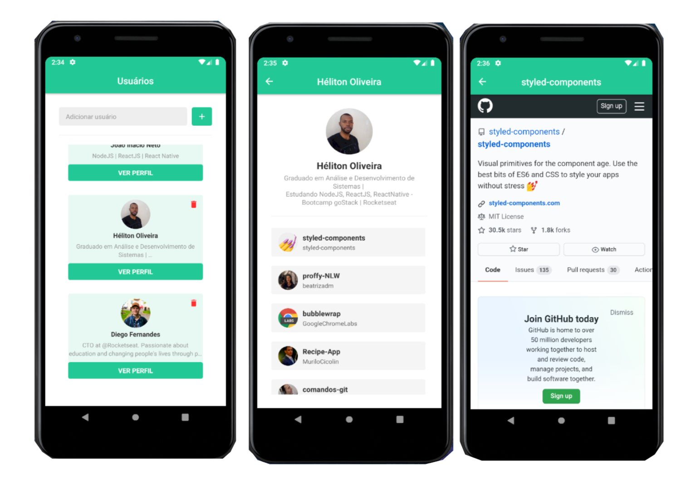

<h2 align="center">Desafio 6: Primeiro projeto com React Native</h2>

<h1>
  
</h1>

## **Sobre o app**

É uma app onde o usuário pode entrar com o nome de um perfil do Github e adicionar esses perfis em uma lista. O usuário também pode clicar em ver perfil e conferir os repositórios favoritos daquele perfil.

## **Sobre o desafio**

A proposta do desafio é adicionar navas funcionalidades ao app que foi desenvolvido na aulas.

### **Funcionalidades adicionadas**

* Loading de repositórios

  quando o usuário clica em ver perfil é apresentado o perfil do próprio usuário como também uma lista com os repositórios que ele favoritou.

* Scroll infinito

* WebView

  quando o usuário clica em um dos repositórios favoritos, abre o Github do repositórios em uma Webview com todas as informações do repositório.

### **Outras funcionalidades**

Fui um pouco além do proposto no desafio, e incrementei alguns ajustes na aplicação.

* Mudei as cores do layout original
* Implementei a funcionalidade de deletar um perfil

Feito com 💙 by Héliton Oliveira

